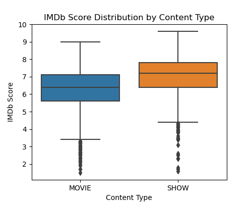
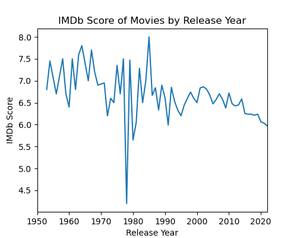
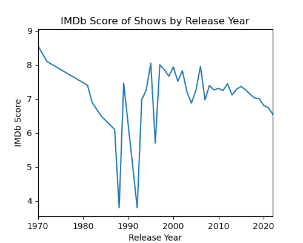
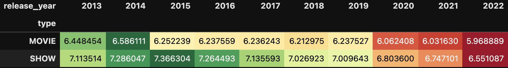
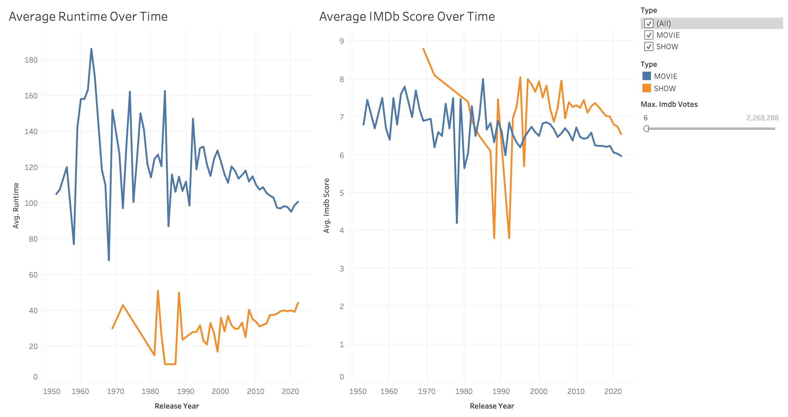

# 🎬 Project Overview

This project aims to explore and analyze the characteristics and performance of Netflix content using publicly available data from Kaggle.

Through a series of business-oriented questions, I investigate how different factors — such as **content type (Movie vs. Show), release year, age certification** — relate to **viewer ratings and engagement**.

The main goal is to generate actionable insights that could help answer executive-level questions like:
- What type of content is better received by audiences?
- Are certain age groups or genres associated with higher-rated content?
- How do release trends affect viewer satisfaction?

To answer these questions, I perform an extensive exploratory data analysis (EDA) using **Python (pandas, seaborn, matplotlib)**, and visualize key insights with **Tableau**.

This project is part of my data science portfolio and is designed to showcase my skills in:
- Data cleaning and transformation with `pandas`
- Exploratory analysis and hypothesis building
- Visual storytelling with `matplotlib`, `seaborn` and `Tableau`
- Business thinking and insight generation

## 📌 Question 1: How does the content type affect the IMDB scores?

To investigate this, I analyzed IMDb ratings by content type (`MOVIE` vs `SHOW`) and followed a structured questioning process.

### 🔍 Step 1: Compare average IMDb scores

I began by calculating the **mean IMDb score** for each content type:
- Movies: 6.27  
- Shows: 7.02  

>This raised the question:  
>"Could this difference in average be due to the different number of entries for each content type in the dataset?"

---

### 🔍 Step 2: Examine the number of entries

Next, I checked the dataset size:
- Movies: 3,407 entries  
- Shows: 1,876 entries  

Since there are nearly twice as many movies as shows, this could introduce more **variability** and possibly more **outliers**, which may pull the average IMDb score for movies down.

> So I asked myself:  
> "Would the **median** score — which is more resistant to outliers — still favor shows?"

---

### 🔍 Step 3: Compare median IMDb scores

- Movie median: 6.4  
- Show median: 7.2  

Even when using median, **TV shows outperform movies**.

> Interpretation:  
> The result is not driven by a few high-rated shows or low-rated movies - the difference is consistent across the distribution.

---

### 🔍 Step 4: Explore the role of outliers

To test whether outliers could be affecting this result, I calculated the number and percentage of outliers based on the 1.5 x IQR rule.

- Outliers in movies: 54 (≈**1.02%**)  
- Outliers in shows: 44 (≈**0.83%**)  

> New question:  
> Is this small difference in outlier percentage enough to impact the results?

The answer is likely no - the difference in outlier ratio is **too small to account** for the substantial gap in scores.

---

### Conclusion

Netflix **TV shows consistently achieve higher IMDb scores** (both mean and median), with **only slightly fewer outliers**.  
This suggests that shows are not only well-produced, but also **more consistently appreciated** by viewers than movies on the platform.

### 📉 Boxplot: IMDb Score Distribution by Content Type

To visually support the analysis, I plotted a boxplot comparing the IMDb score distribution of movies and TV shows. The plot helps to see:
- The central tendency (median line)
- The spread of ratings (IQR)
- Outliers (dots)

---
## 📌 Question 2: Has Netflix Content Quality Decreased Over Time?

To understand whether content quality is improving or declining over time, I analyzed the average IMDb scores of Netflix movies and shows by their release year.

- Especially for **TV shows**, there appears to be **significant fluctuation across years**, likely due to **fewer entries** in the dataset. This makes year-over-year trends for shows less stable.
- For both content types, there is **no strong or consistent upward or downward pattern**. However, the general trend line suggests that **IMDb scores may be gradually declining over time**.
- This could indicate either a **shift in audience expectations**, **content saturation**, or simply a change in rating behavior over the years.

📌 While not conclusive, the data implies that Netflix content — particularly movies — might be receiving slightly lower ratings in more recent years.

    
    

### Pivot Table

---

### 📊 Interactive Tableau Dashboard

I created a dynamic dashboard using Tableau to explore key findings with interactive filters.

🔗 **View the live dashboard here:**  
[👉 Netflix Data Dashboard on Tableau Public](https://public.tableau.com/views/NetflixData_17528623084250/Dashboard1?:language=en-GB&publish=yes&:sid=&:redirect=auth&:display_count=n&:origin=viz_share_link)

